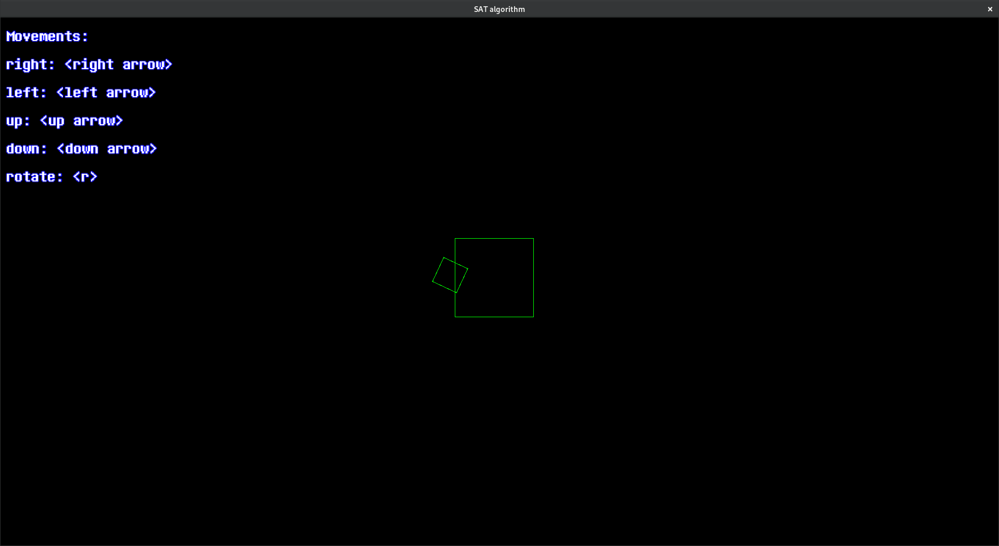

# SAT

> If you like this project don't hesitate to star it ! :)

The Separated Axis Theorem, is a collision detection algorithm between rotated polygons.

This programme demonstrates how this algorithm works with two squares that you can moove and rotate.

## How to use it
### Prerequies:
You need to be on **linux** to execute the binary and have csfml installed.
### Installation
1. Click on code and download the code as zip.
2. Launch a terminal and go to root of the download code
3. Run the code with `make` then `./sat_algorithm`

